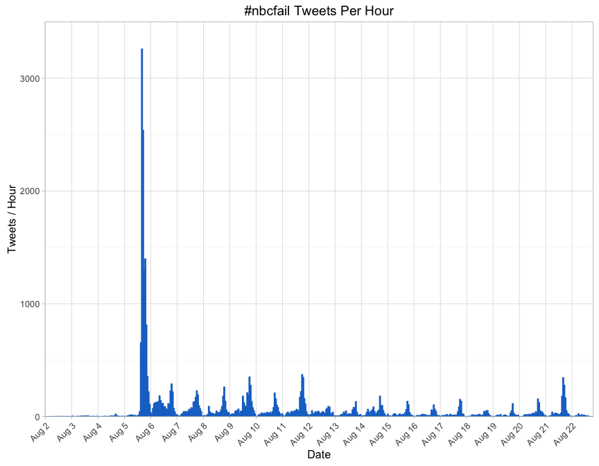
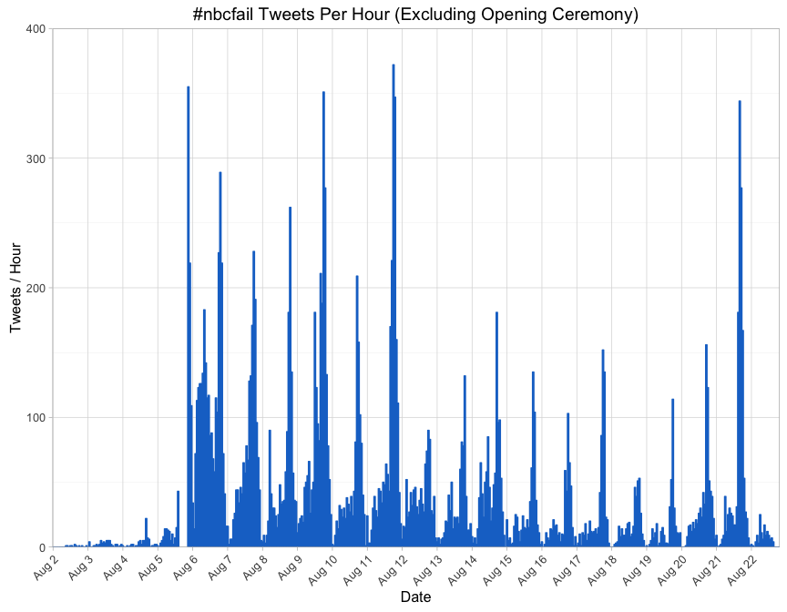
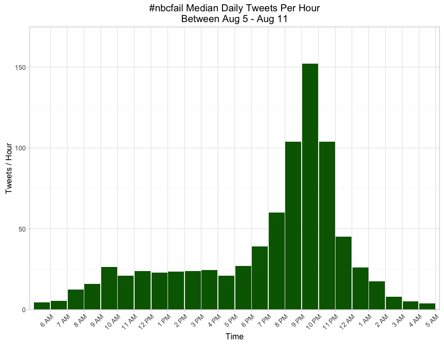

# \#nbcfail
Joe Willage  
August 11, 2016  


NBC has taken a lot of heat in the past week for its coverage of the Olympics, to which they have exclusive broadcast rights. Criticisms have ranged from tape delays, to nationality bias, to commercial frequency, to gender bias. The collective outrage has spawned the popularity of an #nbcfail hashtag on Twitter, which first appeared during the 2012 games. Here we'll explore NBC's responsivenes to the hashtag. First, let's analyze its usage.  


Tweets were pulled at Aug 11, 4 PM and go back to Aug 2, 2 PM. So that's where the data cuts off[^1]. We captured 20,150 tweets in that span. 



The biggest spike in #nbcfail tweets is during the opening ceremony, on the evening of Aug 5. The volume of tweets is so much larger at that point, that it makes it hard to visualize the rest of the data. For now, we'll cut the graph off to omit that evening, but we'll come back to it later.  




We can see that there was some use of the #nbcfail hashtag even before the opening ceremony. The tweets from Aug 3 up to the night of Aug 5 were mostly about the 1-hour delay that NBC announced. There were also a handful of tweets speculating on the resurgance of the #nbcfail hashtag, and complaints about commercials cutting into a soccer game (Olympic soccer started prior to the opening ceremony).  

In the days after the opening ceremony, the hashtag's frequency roughly follows this trend: increases throughout the day, peaking during primetime coverage, and then dying down starting at midnight, reaching its lowest volume around 6 AM EDT.  



\#nbcfail tweets were most frequent during the opening ceremony. NBC aired the ceremony at 8 PM EDT. Hashtag usage peaked between 8 - 9 PM EDT.  


In the timeframe we looked at, @nbc and @NBCOlympics had received a total of 1,048 tweets directed at them, containing the #nbcfail hashtag. And in that time, both accounts tweeted a combined 2,302 times, with 37 tweets being @replies. 0 of those came from the @nbc handle. Here is a breakdown of the 37 @NBCOlympics replies.  


```
       replyToSN Replies
     NBCOlympics       8
     bosshog2477       2
     Eigbrettmom       2
    Aleighastar1       1
        amancoci       1
      annmjensen       1
       aparnaa_s       1
        BuzzFeed       1
 Dexter_Freedman       1
        ebrooksb       1
    faithfulmeg3       1
        hodakotb       1
   JoshIsTweetin       1
    katieledecky       1
     kitsaber691       1
         kumailn       1
        Lesdoggg       1
     marissad415       1
       mjbestero       1
      pkligerman       1
    RyanSeacrest       1
     soccernik06       1
         theuke1       1
      Tweet_Alie       1
          USAGym       1
 Venuseswilliams       1
         Webbilt       1
    YesIAmTeeCee       1
```

4 of those replies were in fact to #nbcfail tweets. They reply "The race is LIVE tonight on @NBC, in Primetime" (twice) and "WATCH LIVE HERE: https://t.co/RMGFoodRbX" (twice). So out of 20,150 complaints, of which 1,048 were directly addressed to them, @nbc/\@NBCOlympics replied to 4 of them, or 0.02%. Given the volume of tweets, I wouldn't expect a reply to each of them, but I'm curious why they chose the 4 (and only 4) that they did.  

For context, let's compare that to the recent computer outage that caused Delta to cancel hundreds of flights. There wasn't a particular hashtag in this situation, and we can't just take every tweet which mentions @delta. So our dataset will consist of all tweets directed to @Delta and @DeltaAssist on August 8th and 9th[^2], under the assumption that most of these represent people needing assistance. 


There were 12,217 tweets to Delta between Aug 8 - 9. Looking at the first few records confirms that these tweets are looking for a response. 


```
[1] "@Delta I urgently need to talk to a customer rep!!! Called at 1 pm MST and was told I'd get a call back within 3 hours. It's now 6pm MST \xed\xa0\xbd\xed\xb8\xb3"
[2] "@Delta check dm \xed\xa0\xbd\xed\xb9\x84"                                                                                                                    
[3] "@Delta you guys going to get your stuff together or nah? Cause I gotta get home..."                                                                   
```

To get a sense of the situation, here's the tweets per hour breakdown.  


Now we'll examine the rate of reply from @Delta and @DeltaAssist. During the 2-day span, both handles sent a combined 2,574 replies, and 1,506 were in response to tweets in our dataset. That amounts to at least a 12.33% reply rate, thought its likely higher[^1].


We can also see that Delta's replies include a signature at the end of the tweets, and there appear to be 38 staffers signing off as @Delta/\@DeltaAssist.


```
[1] "@zach_broujos My apologies for the wait. Please DM your confirmation # I will be happy to check on your flights for you.  *CS"
```

####Conclusion####
Certainly I wouldn't expect a network to treat complaints about TV coverage with the same urgency an airline treats messages about flight cancellations; I just thought it would be an interesting exercise. But its clear that Delta is managing its Twitter handle with a team that's concerned about customer service. The same can't be said about NBC. Maybe they think that because they own exclusive broadcast rights, they don't need to reply to complaints, whereas Delta is concerned about losing customers to other airlines. Whatever the reasons, the contrast is glaring.  

**Code and data available here:** https://github.com/jwillage/nbcfail

[^1]: All times Eastern, UTC-4:00
[^2]: Delta first reported the outage at Aug 8, 5:04 AM https://twitter.com/DeltaNewsHub/status/762575247111520257
[^1]: The calculated number of replies is the number of Delta replies in the *dataset*. its likely they replied to more tweets after the window of the data pull. 
